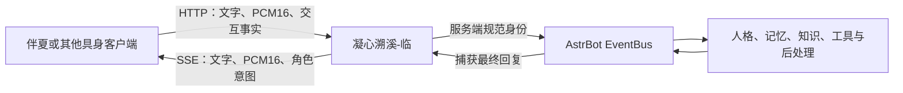

# 凝心溯溪-临


> 让虚拟角色走进现实空间的具身桥接：连接 VR/MR、桌面角色与实体设备，支持实时对话、语音、动作、表情、触碰和空间感知。

> **凝心溯溪系列** 当前完整插件清单为知、言、序、情、境、声、核、临：各插件职责独立、互不冲突，可按需组合使用，覆盖知识学习、对话调节、身份管理、关系状态、环境感知、语音、更新管理与具身桥接。

| 字 | 模块 | 说明 |
|----|------|------|
| [知](https://github.com/qsbb/astrbot_plugin_active_learner) | 知识学习 | 自动检索注入、多源学习、交叉验证 |
| [言](https://github.com/qsbb/astrbot_plugin_conversation_flow) | 对话调节 | 沉默判断、智能分段、插话衔接 |
| [序](https://github.com/qsbb/astrbot_plugin_identity_guardian) | 身份管理 | 关系感知、权限边界、群组行动 |
| [情](https://github.com/qsbb/astrbot_plugin_relationship) | 关系状态 | 情绪、好感、信任、熟悉度状态记录与只读建议 |
| [境](https://github.com/qsbb/astrbot_plugin_environment_awareness) | 环境感知 | 时间、天气、空气质量、预警与环境关心候选 |
| [声](https://github.com/qsbb/astrbot_plugin_voice_hub) | 语音合成 | 双 TTS 后端、多音色管理、AI 导演 |
| [核](https://github.com/qsbb/astrbot_plugin_update_manager) | 更新管理 | 安全检查、计划、串行更新与回滚 |
| [临](https://github.com/qsbb/astrbot_plugin_embodiment_bridge) | 具身桥接 | Quest 客户端桥接、实时对话与空间感知（本插件） |

## 当前实现信息

- 版本号以 `metadata.yaml` 的 `version` 为唯一事实源；逐版变更见 `CHANGELOG.md`。
- AstrBot 兼容范围：`>=4.26,<5`（与 `metadata.yaml` 的 `astrbot_version` 一致）。
- 命令入口：本插件不注册聊天命令，对外接口为 HTTP/SSE（Protocol 1.0，见下文）。
- 页面入口：AstrBot 管理后台的“具身服务控制台”与“具身客户端快速绑定”两个插件页面。

## 简介与定位

`astrbot_plugin_embodiment_bridge` 是 AstrBot 具身桥接插件，连接 VR/MR、桌面角色与实体设备，支持实时对话、语音、动作、表情、触碰和空间感知。它把客户端上报的文字、语音与交互事实送入 AstrBot 正式消息链，再通过 HTTP/SSE 返回文字、PCM 音频和模型无关的角色意图。

协议不绑定设备和模型格式。当前官方参考客户端是运行于 Meta Quest 3 的 [伴夏（Banxia）](https://github.com/qsbb/banxia)，目前实现 PMX/VMD、手追、物理接触、彩透和房间交互。

### 参与项目

本项目希望先提供一条可运行、可验证的具身 AI 接入路径，以此抛砖引玉，而不是把当前实现当作唯一答案。欢迎通过 [Issues](https://github.com/qsbb/astrbot_plugin_embodiment_bridge/issues) 反馈设备兼容、协议、安全和交互体验问题，也欢迎提交 Pull Request，一起完善客户端适配、服务端能力和文档。

遇到问题建议优先提交 Issue；如需进一步沟通，也可以通过 QQ：`1483904397` 联系作者。反馈时请尽量附上版本、运行环境、复现步骤和脱敏日志，请勿发送 API Key、绑定密钥或其他敏感信息。

提交内容请说明使用环境，并确认拥有所附代码、图片、模型、动作和音频的必要授权。

### 前后端仓库

| 项目 | 职责 | 仓库 |
|---|---|---|
| 凝心溯溪-临 | AstrBot 消息链、身份授权、配对、STT/TTS、动作意图和诊断 | [qsbb/astrbot_plugin_embodiment_bridge](https://github.com/qsbb/astrbot_plugin_embodiment_bridge) |
| 伴夏（Banxia） | Unity/XR 客户端、PMX/VMD、手追、物理接触、彩透、房间理解和音频播放 | [qsbb/banxia](https://github.com/qsbb/banxia) |

伴夏是 Protocol 1.0 的参考客户端，不是唯一客户端。第三方客户端遵守认证、事件顺序、音频格式和意图白名单后，也可以复用本插件；两个项目保持独立版本和独立发布。

### 消息链路



Bridge 使用服务端保存的 Bot、User 和可信平台创建正式 AstrBot 消息事件。客户端不能自报管理员身份、平台、人格或自然人；AstrBot 生成的回复只返回当前具身客户端，不会重复发送到绑定的 QQ 等原平台。

#### 交付与兼容边界

临创建的合成事件会携带 `delivery_owner=embodiment_bridge` 和
`capture_required=true`。临只捕获该事件自身的 `event.send()`/流式发送、最终结果链或已声明的
`conversation_flow.delivery_plan@1.0`；状态页用 `captured`、`result_recovered`、`plan_recovered`、
`action_only`、`unobserved` 区分这些来源。

第三方插件直接调用 `context.send_message()` 或平台发送 API 时，临不会全局接管这些调用，也不会
据此猜测正文已经交付。若没有可观察结果，会记录固定的 `external_direct_send_or_empty` 诊断并按
原有空回复策略失败关闭。这样保留第三方插件兼容性，同时避免把别的会话消息误收进 Quest。

`allow_direct_provider_fallback` 默认关闭。正式消息链不可用时会明确报错，避免静默绕过记忆、知识和后处理插件；触碰等受控交互仍使用独立的兼容决策路径。

## 功能

- 让具身客户端的普通文字和语音进入 AstrBot EventBus，经过已配置的人格、历史、记忆、知识、工具及后处理插件。
- 使用 Protocol 1.0 提供 HTTP 上行与 SSE 下行，支持轮次打断、新轮仲裁、迟到事件隔离、有界队列和慢客户端背压。
- 支持实时打断：`/interrupt` 或新轮 `cancel_previous` 会取消旧轮的回复、快速动作与流式 STT 任务并丢弃其排队事件；客户端可经 `/playback/receipt` 回报播放进度与中断，仅作脱敏诊断。
- 接收 PCM16 16 kHz 单声道输入；实时流式 STT（Fun-ASR-Realtime，默认关闭）在说话过程中即时产出仅供诊断的 partial，`audio/end` 后收敛 final 并启动 LLM；未启用流式或流式失败/超时时回退整段 PCM 文件式 STT，非空 final 才进入正式轮次。
- 优先复用“声”的 `voice.audio_output@1.0`，也可回退 AstrBot Core TTS；统一输出 PCM16 24 kHz 单声道音频。
- 输出受白名单约束的情绪、动作和注视意图，不向客户端发送骨骼、Morph、动画路径或 Unity 对象。
- 上报握手、摸头、捏脸、注视和说话等交互事实，由后端结合身份、关系和边界决定反应。
- 接收按会话隔离的脱敏房间语义快照，只包含地面、座位、床、桌、墙、门窗计数和场景能力布尔值；不上传图像、网格、坐标、尺寸或房间标识。
- 提供一次性二维码与 6 位短码配对，客户端无需手工搬运长期密钥和完整 API 路径。
- 提供直连/交互决策模型、正式平台、身份、STT、人格转换、可选关系增强、服务启停和诊断管理页面。
- 可以单独安装；安装凝心溯溪系列插件后，通过公开、版本化契约复用知识、身份、关系、环境、语音和诊断能力。

## 快速开始

运行要求：AstrBot `>=4.26,<5`、一个可用的 Chat Completion Provider，以及客户端能够访问的 AstrBot 主机。STT、TTS 和其他凝心溯溪插件均为可选能力。Python 依赖（Pydantic、aiohttp、python-qrcode 及 Python 3.13+ 条件依赖 audioop-lts）由 `requirements.txt` 单独安装，源码未复制进本仓库。

1. 将仓库目录安装为 `data/plugins/astrbot_plugin_embodiment_bridge/`，安装 [requirements.txt](requirements.txt) 后重载插件。
2. 在 AstrBot 管理后台创建并启用平台或会话默认聊天模型；需要语音输入时，再创建一个正式 STT Provider。
3. 在 AstrBot“设置 → API Key 管理”创建一把具身客户端专用 API Key，至少授予 `plugin` scope。密钥明文通常只显示一次。
4. 打开插件的“具身服务控制台”Page。若需要正式 EventBus、记忆和其他消息插件，选择平台并完成高级身份验证；如果不想配置 Bot/User 或安装“序”，可开启“基础对话模式”，只选择一个临的聊天 Provider，Quest 对话会隔离直连该 Provider，不进入 EventBus。
5. 在插件配置中启用内置 listener。私网 Docker 部署的最小示例：

   ```text
   bridge_service_enabled=true
   pairing_listener_enabled=true
   pairing_listener_host=0.0.0.0
   pairing_listener_port=8520
   pairing_listener_upstream_url=http://127.0.0.1:6185
   pairing_listener_public_url=http://192.168.50.10:8520
   pairing_public_url=http://192.168.50.10:8520
   allow_private_http_pairing=true
   ```

6. Docker 同时映射 `8520:8520`。端口映射本身不会创建监听器，控制台必须显示 listener ready。
7. 打开“具身客户端快速绑定”Page 生成 6 位短码。伴夏只需输入域名或 IP、端口和短码即可完成绑定。
8. 通过控制台状态、认证后的 `/health` 和脱敏日志确认 EventBus、身份、STT/TTS 与 listener 状态。

公网部署必须使用客户端信任的 HTTPS，并在防火墙或反向代理继续限制来源与速率。内置 8520 listener 不提供 TLS，也不是 Dashboard 或任意 URL 的通用代理。

完整安装、Docker、curl 与安全说明见 [本地联调文档](docs/LOCAL_INTEGRATION_CN.md)，配对步骤见 [快速绑定文档](docs/PAIRING_CN.md)。

## 配置摘要

完整配置项以 `_conf_schema.json` 为准。推荐优先通过“具身服务控制台”管理模型、平台、身份、人格和端口，避免直接编辑内部迁移字段。

| 配置 | 默认值 | 作用 |
|---|---:|---|
| `bridge_service_enabled` | `true` | 启停具身对话服务；关闭时清理现有会话和 listener |
| `chat_provider_id` | 空 | 触碰/动作决策及显式直连回退使用的 Provider；不覆盖正常 EventBus 对话的默认模型 |
| `fast_action_enabled` | `true` | 保留旧版快速动作配置兼容性；当前普通对话不会启动该 Provider，动作只由明确本地指令、交互通道或客户端回执驱动 |
| `fast_action_provider_id` | 空 | 快速动作专用 Chat Completion Provider；与普通对话模型独立，建议选择低延迟模型 |
| `fast_action_timeout_seconds` | `6.0` | 旧配置保留；普通对话不再发起快速动作请求。明确动作不等待该 Provider。Operator Page 仍可读取兼容状态 |
| `fast_action_timeout_policy_revision` | 空 | 审计字段；revision 为空或旧版 `v2` 且值为 4.0 时识别为旧默认并按 6.0 effective 运行，管理页保存后写入 `v3`，显式保存的 4.0 不会被覆盖 |
| `enable_astrbot_message_pipeline` | `true` | 让普通文字和语音进入 AstrBot 正式消息链 |
| `allow_direct_provider_fallback` | `false` | 正式链路失败时是否允许直连 Provider；不建议用它掩盖配置问题 |
| `quest_direct_dialogue_mode` | `false` | 无平台身份的基础对话模式；不进入 EventBus，不需要 Bot/User 或“序”，关系/记忆/其他消息插件不会注入 |
| `pairing_listener_enabled` | `false` | 启用严格白名单内置 listener |
| `pairing_listener_port` | `8520` | listener 监听端口，范围 1024–65535 |
| `pairing_listener_public_url` | 空 | 客户端可访问的 listener 地址 |
| `pairing_public_url` | 空 | 配对成功后下发的正常 Bridge 基地址 |
| `allow_private_http_pairing` | `false` | 仅在受控私网 IP 上允许明文 HTTP |
| `bridge_api_key` | 空 | Bridge 第二层认证密钥；至少 32 个随机字符，可由身份保存流程生成 |
| `pairing_astrbot_api_key` | 空 | 具身客户端专用、具有 `plugin` scope 的 AstrBot API Key |
| `trusted_client_id` | 空 | 服务端固定的客户端标识 |
| `trusted_platform_id` | 空 | 创建正式 EventBus 消息所使用的已加载平台实例 |
| `relationship_person_id` | 空 | 可选的“情”自然人映射；不授予 owner 或管理权限 |
| `astrbot_stt_provider_id` | 空 | 显式选择的整段文件式 STT Provider；留空关闭语音识别 |
| `streaming_stt_provider` | 空 | 实时流式 STT 供应商，`funasr_realtime` 即启用；留空关闭实时识别 |
| `streaming_stt_api_key` | 空 | DashScope 实时 ASR 的 Bearer API Key（`secret`，不回显不落诊断） |
| `streaming_stt_model` | `fun-asr-realtime` | 实时流式 STT 模型 |
| `streaming_stt_language` | `zh` | 实时流式 STT 语言标记 |
| `streaming_stt_connect_timeout_seconds` | `8.0` | 实时流式 STT 建连超时（秒） |
| `streaming_stt_final_grace_seconds` | `2.0` | `audio/end` 后等待流式最终结果的宽限（秒），超时回退文件式 |
| `enable_voice_hub_tts` | `true` | 优先使用“声”的 PCM WAV 契约 |
| `enable_astrbot_tts` | `false` | 允许回退到 AstrBot 当前 Core TTS Provider |
| `persona_source_mode` | `astrbot` | 继承 AstrBot 人格或启用兼容手动覆盖 |
| `persona_converter_provider_id` | 空 | 只用于把 AstrBot 人格转换成具身人格的独立 Provider |
| `active_quest_persona_id` | 空 | 当前启用的具身人格文件；空值表示实时继承 AstrBot |

Provider 下拉列表和管理响应只返回必要的安全摘要，不返回 API Key、Base URL、请求头或原始 Provider 配置。完整配置项和人格边界见 [API 文档](docs/API_CN.md) 与 [人格集成文档](docs/PERSONA_INTEGRATION_CN.md)。

动作边界分为两层：普通对话由主 LLM 只生成自然语言回复，动作工具、动作反馈和遗留动作字段都不会暴露给它；即使直连/降级适配器返回旧动作字段，编排层也会收敛为 `talk` 或 `idle`。明确的整句动作命令（包括“下蹲/蹲下/crouch/squat”）由严格解析器在本地选择，不等待任何动作 Provider；触碰/手势由独立交互通道处理。否定、引用、假设、讨论或多动作表达不会猜测执行。客户端通过双重认证回报 `completed/rejected/interrupted` 后，后续同会话 EventBus 轮次才会把该终态作为身体事实读取。

## 使用

- 本插件不注册聊天命令，也不让主对话 LLM 自主选择动作；对话通过 AstrBot 正式消息链中的钩子完成，明确动作由本地解析器、触碰/手势通道和客户端回执驱动，客户端经 HTTP/SSE 交互。
- 管理页面：“具身服务控制台”管理模型、平台、身份、人格、STT/TTS、端口与诊断；“具身客户端快速绑定”生成一次性二维码与 6 位短码完成配对。
- 运行状态通过控制台状态区、认证后的 `/health` 接口与脱敏日志确认。

## Protocol 1.0

新客户端使用以下基地址：

```text
/api/v1/plugins/extensions/astrbot_plugin_embodiment_bridge
```

配对后的正常请求，包括 SSE 和 `/health`，必须同时携带：

```http
Authorization: ApiKey <具有 plugin scope 的专用 Key>
X-Embodiment-Bridge-Key: <bridge_api_key>
```

| 方法 | 路径 | 成功状态 | 用途 |
|---|---|---:|---|
| POST | `/session/start` | 201 | 创建绑定到认证主体的会话 |
| GET | `/events/<session_id>` | 200 | 建立该会话唯一的 SSE 下行流 |
| POST | `/turn/start` | 202 | 开始文字或语音轮次 |
| POST | `/audio/chunk` | 202 | 上传 PCM16 单声道 16 kHz 输入块 |
| POST | `/audio/end` | 202 | 完成输入并启动 STT 与决策 |
| POST | `/playback/receipt` | 200 | 回报客户端播放进度与中断，仅作脱敏诊断 |
| POST | `/interaction` | 202 | 上报交互事实 |
| POST | `/action/result` | 200 | 回报服务端动作意图的客户端执行状态 |
| POST | `/interrupt` | 200 | 取消轮次并阻止迟到事件 |
| POST | `/session/close` | 200 | 关闭并清理会话 |
| POST | `/spatial/context` | 200 | 更新按会话隔离的脱敏房间语义快照 |
| GET | `/health` | 200 | 读取协议与能力的脱敏状态 |

SSE 事件包括 `asr.partial`、`asr.final`、`avatar.intent`、`reply.text.delta`、`reply.audio.chunk`、`reply.end` 和 `error`。音频块带 `speech_id`（当前等于产生该音频的 `turn_id`）、自 0 严格递增 `sequence` 与首块标记，`reply.end` 带最后音频序号（未发送音频时为 `-1`），供客户端在打断后丢弃旧轮迟到音频。当前文件式 STT 不产生 `asr.partial`；仅当已选 AstrBot STT Provider 明确提供流式契约时才可产生 partial，且 partial 只用于设备 UI/诊断，绝不进入 EventBus、记忆或工具；只有非空 final 作为该轮识别结果进入正式消息链，流式无 final、失败或队列背压时回退整轮文件式识别。输出音频固定为 PCM16 单声道 24 kHz。

打断与轮次仲裁：`/interrupt` 的 `turn_id` 可省略，省略时打断当前轮；被打断的轮次不再发送文字、音频、动作或 `reply.end`，目标轮已不是当前轮时返回 `cancelled=false`。`turn/start` 的 `cancel_previous` 默认为 `true`，新轮会取消旧轮的回复、快速动作与流式 STT 任务并丢弃其排队事件；设为 `false` 且已有活动轮时返回 `409 session_conflict`。交互事实使用独立的有界槽位，不抢占进行中的对话轮次。取消、关闭会话或开启新轮时，旧轮的流式 STT 队列与任务会被清空，旧轮音频不再进入处理链。

`/playback/receipt` 接受 `playback.started`、`playback.progress`、`playback.ended` 和 `playback.interrupted`，携带已播放毫秒、缓冲毫秒与欠载计数；`speech_id` 必须等于对应 `turn_id`，只接受当前轮或完成后 90 秒保留窗口内的轮次。回执只写入脱敏诊断，不进入 EventBus、记忆或工具。

空间快照只包含有界的物体计数与能力布尔值，30 秒未刷新即失效；官方客户端以 15 秒低频续租，并对相同内容去重。图像、网格、坐标、尺寸、锚点和自由文本不会进入该通道。

交互事实只接受 `handshake`、`head_pat`、`cheek_pinch`、`gaze` 和 `speaking`。角色意图使用受控的 `action_id + method + parameters + transition + source`，并保留 `gesture` 等旧字段。转身只允许有界角度，下蹲只允许深度与保持时间，未知字段、枚举或越界值不会透传给客户端。

`session.start.supported_actions` 是可选能力声明；服务端只在本地动作控制器中使用声明值与注册表的交集，绝不把动作枚举交给主 LLM。省略它的旧客户端继续使用旧动作集，但不会收到新增 `crouch`。可执行动作的 `avatar.intent` 会附带服务端生成的 `action_id`。客户端以 `/action/result` 回报 `accepted -> started -> completed`，或回报 `rejected` / `interrupted`；`idle`、`talk` 无需回执。经过双层认证且匹配原动作计划的终态只保存在本地回执状态，用于控制器和诊断，不注入 EventBus、主 LLM、记忆或普通对话上下文。

内置 listener 的匿名能力只限新插件 ID 下的精确 `POST .../pairing/exchange`。它接受一次性 token 或 6 位短码，并实施凭据过期、单次消费、正文限制、来源限速和全局限速；其他运行接口仍必须携带双层认证。

完整请求 schema、SSE 顺序、管理端点、错误码、背压与重连语义见 [Protocol 1.0 API 文档](docs/API_CN.md)。机器可读样本位于 [fixtures/protocol_v1/](fixtures/protocol_v1/)。

## 兼容性

- AstrBot 版本：`>=4.26,<5`，以 `metadata.yaml` 的 `astrbot_version` 为准。
- 已测客户端：运行于 Meta Quest 3 的官方参考客户端伴夏（Banxia）；其他客户端按 Protocol 1.0 对齐认证、事件顺序、音频格式与意图白名单后亦可接入。
- 协议不绑定设备与模型格式；STT、TTS 与凝心溯溪系列其他插件均为可选能力，缺失时按各自边界降级。

## 从旧插件 ID 升级

`1.0.0` 将内部插件 ID 从 `astrbot_plugin_quest_avatar_bridge` 改为 `astrbot_plugin_embodiment_bridge`。

升级前请备份旧插件目录、`data/config/astrbot_plugin_quest_avatar_bridge_config.json` 和 `data/plugin_data/astrbot_plugin_quest_avatar_bridge/`，停止旧插件后使用新目录名安装，并完整重启 AstrBot。AstrBot 当前没有 Web API 注销接口，只热重载可能让旧路由继续留在进程中。

首次启动会以非破坏方式迁移已知配置并复制旧数据：

- 已存在的新配置和新数据优先，不会与旧内容静默合并。
- 旧配置文件和旧数据目录不会被删除。
- 符号链接、Junction、超限或畸形输入会失败关闭。
- 旧 URL 中的插件根路径会迁移到新 ID；密钥不会写入日志或管理响应。

已绑定客户端有一个主版本周期的兼容窗口：旧十个运行 API 路径与 `X-Quest-Avatar-Key` 仍可通过双层认证访问。旧插件 ID 下的匿名 `pairing/exchange` 不开放，因此建议升级后重新生成短码并配对。Protocol 1.0 的 QR type、既有配置字段以及跨插件 `identity.quest_*`、`relationship.quest_*` 契约名暂时保持不变。

## 系列诊断日志

临提供 `series.diagnostics@1.0`，供凝心溯溪“核”聚合只读运行时诊断。另有默认关闭的独立诊断日志：仅写入插件自有 `data/plugin_data` 目录，不接入 AstrBot 总日志，只记录事件状态、错误码与耗时，不写入正文、身份、凭据或音频。详见 [独立诊断日志文档](docs/DIAGNOSTIC_LOG_CN.md)。

## 系列控制

临提供 `series.control@1.0`，供凝心溯溪“核”统一管理少量非秘密运行策略。可接管字段包括诊断日志开关、最大会话数、事件队列、音频边界、交互去抖、输出分块和 SSE 心跳等。Bridge Key、Provider、人格、自然人和任何账号/权限字段不属于该契约。

覆盖快照由临在插件数据目录中原子保存；核不可用、契约不兼容、revision 冲突或快照损坏时，临继续使用自身配置。关闭统一接管后无需重启即可恢复原生配置。

## 凝心溯溪系列

“临”可以单独安装。推荐按需要组合凝心溯溪系列（完整模块清单见文首表格）；提供方缺失或契约不兼容时，临会按各能力边界降级，不读取其他插件的私有配置或内部存储。临当前不消费“枢”的 resolver。

临实际消费的契约、调用频率、授权条件和失败行为见 [凝心溯溪系列集成文档](docs/SERIES_INTEGRATIONS_CN.md)。

## 开发与验证

测试位于 `tests/`，开发依赖见 `requirements-dev.txt`：

```bash
pip install -r requirements-dev.txt
python -m pytest tests/
```

## 文档

- [Protocol 1.0 与管理 API](docs/API_CN.md)
- [本地部署、Docker、curl 与安全配置](docs/LOCAL_INTEGRATION_CN.md)
- [一次性配对流程](docs/PAIRING_CN.md)
- [AstrBot 人格继承与具身人格转换](docs/PERSONA_INTEGRATION_CN.md)
- [凝心溯溪系列契约集成](docs/SERIES_INTEGRATIONS_CN.md)
- [独立诊断日志](docs/DIAGNOSTIC_LOG_CN.md)
- [机器可读协议样本](fixtures/protocol_v1/)

## 使用与参考

本插件直接运行于 [AstrBot](https://github.com/AstrBotDevs/AstrBot)，并使用 [Pydantic](https://github.com/pydantic/pydantic)、[aiohttp](https://github.com/aio-libs/aiohttp)、[python-qrcode](https://github.com/lincolnloop/python-qrcode) 与 Python 3.13+ 条件依赖 `audioop-lts`。依赖由 `requirements.txt` 单独安装，源码未复制进本仓库。

以下项目用于研究协议拆分、实时事件、打断、异步管线和具身客户端组织方式。“参考”表示阅读公开设计后独立实现，不表示复制其源码、素材或品牌：

| 项目 | 参考点 | 上游许可 |
|---|---|---|
| [伴夏](https://github.com/qsbb/banxia) | Protocol 1.0 官方客户端与设备侧实现 | MPL-2.0；第三方组件和用户资源按各自条款 |
| [OpenAI Realtime Console](https://github.com/openai/openai-realtime-console) | 实时音频事件、打断和调试可观察性 | MIT |
| [Gemini Live API Web Console](https://github.com/google-gemini/live-api-web-console) | PCM 队列、全双工会话和多模态通道 | Apache-2.0 |
| [Pipecat](https://github.com/pipecat-ai/pipecat) | 异步处理管线、轮次和 barge-in | BSD-2-Clause |
| [Open-LLM-VTuber](https://github.com/Open-LLM-VTuber/Open-LLM-VTuber) | VAD、可取消会话与表情映射 | MIT；其 Live2D 样例模型另有条款 |
| [Together Companion](https://github.com/menglimi/astrbot_plugin_together_companion) | AstrBot 消息链、连续识别和房间连接思路 | 仓库未声明许可证；仅作行为参考，未复制或分发代码 |

更完整的依赖、参考项目和头像授权边界见 [THIRD_PARTY_NOTICES.md](THIRD_PARTY_NOTICES.md)。

## 许可证

本仓库原创源码采用 [Mozilla Public License 2.0](LICENSE)。修改 MPL 覆盖的源码文件并分发时，需要继续公开这些文件的源码和修改；它不会自动要求与本项目组合的独立文件采用同一许可证。

AstrBot、Python 依赖、参考项目、头像及其他第三方内容继续遵守各自许可证或授权，MPL-2.0 不会替代其上游条款。
