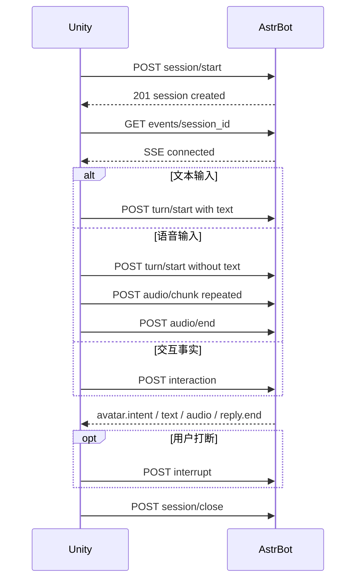

# AstrBot Embodiment Bridge 客户端接口文档

本文档面向实现 Protocol 1.0 的具身客户端；当前官方客户端“伴夏”运行于 Meta Quest 3，并实现 PMX/VMD。插件作者为 `qsbb`，展示名为“凝心溯溪-临”。

本机 AstrBot/Unity 部署步骤、安全配置和 curl 联调命令见 [LOCAL_INTEGRATION_CN.md](LOCAL_INTEGRATION_CN.md)。可执行协议样本位于 [`fixtures/protocol_v1/`](../fixtures/protocol_v1/)。

## 1.0.8 动作与诊断补充

快速动作仍只使用 Protocol 1.0 的模型无关 `avatar.intent`。动作模型和 AstrBot EventBus 工具共享同一轮唯一仲裁：任何一方先取得动作槽，另一方记录为 `deferred`/`superseded`，不会重复下发动作。快速动作任务与正文、TTS 并行；当 Provider 超时或返回空动作时，文字和音频继续发送，并在 `reply.end` 前下发 `talk`/`idle` 安全回退。

临独立诊断会记录 `fast_action.*`、`avatar.action.*` 的阶段、状态、来源、白名单动作、超时/空结果、仲裁胜者和意图下发状态。不会记录用户文本、Provider ID、身份、密钥或音频。`audio/chunk` 的成功 202 不逐块记录；一次 `audio/end` 后输出一条 `audio.upload.completed`，包含块数、字节数、HTTP 状态和耗时。

## 1. 协议概览

- 协议版本：`1.0`
- Unity 到 AstrBot：HTTP POST
- AstrBot 到 Unity：SSE
- 输入音频：PCM16、小端、单声道、16000 Hz
- 输出音频：PCM16、小端、单声道、24000 Hz，SSE 中使用 Base64
- 字符编码：UTF-8
- 时间单位：毫秒

Unity 只上报事实、播放音频并执行模型无关的语义意图。角色是否回应、是否接受触碰、情绪、动作、注视、强度和持续时间都由 AstrBot 决定。

### 1.1 语音适配器可用性

STT 与 AstrBot Core TTS 默认关闭。管理员在具身服务控制台中把 `astrbot_stt_provider_id` 显式设置为一个已实例化的正式 `STTProvider` 后，Bridge 才调用其 `get_text(audio_url)`；所选实例缺失时失败关闭，不自动切换其他 Provider。目录和状态只包含 `id`、`model`、`adapter_type`、`provider_type`，不读取或返回 Provider 原始配置、API 地址、API Key 或 headers。AstrBot 当前没有面向普通 Star 插件的稳定 STT tool/contract；第三方能力必须通过 AstrBot 正式 Provider 机制注册为 `STTProvider` 才能被选择。

旧版 Bridge 私有 MiMo URL、Key、model 不再作为推荐或可见配置入口；迁移到正式 Provider 时会清理旧字段，但管理响应、日志和 Page 都不会回显旧密钥。旧 `enable_astrbot_stt=true` 且新 Provider ID 为空的安装仅保留临时默认 Provider 兼容路径。TTS 边界没有改变：“声”的 `voice.audio_output@1.0` 仍默认作为首选 TTS，缺插件或契约不兼容时安全降级；显式启用的 Core fallback 仍读取 AstrBot 当前默认 TTS Provider。本插件不通过 `hasattr()`/`getattr()` 猜测跨插件接口，也不调用 `voice.delivery@1.0` 或内部 `synthesize_text()`。

STT 是文件式整轮调用：`audio/end` 后才把输入封装成 16000 Hz 单声道 PCM16 WAV 交给 `STTProvider.get_text(audio_url)`，因此当前不会产生 `asr.partial`。TTS Provider 单次调用仍返回文件：Bridge 优先调用“声”的 `render_pcm_wav()`，严格校验 provider 管理的 PCM16 WAV；必要时回退 `TTSProvider.get_audio(text)`。Bridge 会按有界句段顺序调用 Provider，并通过容量为 2 的异步队列尽早发送已完成句段；最终都转换为 24000 Hz 单声道 PCM16 SSE 块。

AstrBot 的 TTS Provider 基类只承诺“返回音频文件路径”，不承诺采样率、声道或编码。本插件接受未压缩 PCM16 WAV（单声道或立体声、8000-192000 Hz），立体声会下混，采样率会转换到 24000 Hz；MP3、压缩/浮点 WAV、截断或超限文件产生 `tts_failed`，文字仍会保留。`emotion` 只参与角色意图决策，不会被猜测性地传给没有该参数的 Provider。

## 2. 服务地址与认证

假设 AstrBot Dashboard 地址为：

```text
http://192.168.1.10:6185
```

接口基地址为：

```text
http://192.168.1.10:6185/api/v1/plugins/extensions/astrbot_plugin_embodiment_bridge
```

启用内置 listener 后，Quest 私网统一入口可改为：

```text
http://192.168.50.10:8520/api/v1/plugins/extensions/astrbot_plugin_embodiment_bridge
```

两者的 Protocol 1.0 请求和 SSE 字段完全一致。8520 只是严格白名单入口，不是 Dashboard 或通用反向代理。

配对完成后的所有正常请求，包括 SSE 和 health，都必须携带：

```http
Authorization: ApiKey <ASTRBOT_API_KEY_WITH_PLUGIN_SCOPE>
X-Embodiment-Bridge-Key: <bridge_api_key>
```

所有 POST 请求还必须携带：

```http
Content-Type: application/json
```

要求：

- AstrBot API Key 必须具有 `plugin` scope。
- `bridge_api_key` 必须与插件配置一致，且配置值至少 32 字符。
- 创建会话和后续访问必须使用同一个 AstrBot API Key 身份。
- 内置 listener 上只有新插件 ID 下的精确 `POST .../pairing/exchange` 不要求 `Authorization` 或 `X-Embodiment-Bridge-Key`；它只接受一次性 token/6 位短码，成功后下发两把长期密钥。旧 Header 仅作已绑定客户端兼容。
- 8520 上的 health/session/events/turn/audio/interaction/interrupt/close 不属于匿名能力，listener 不自动添加或替换任何认证头。
- 私网明文 HTTP 必须同时启用服务端 `allow_private_http_pairing`、Page 本次 `allow_insecure_http`，且 URL 主机是私网 IP 字面量；成功 configuration 才会给 Unity `allow_insecure_http=true`。
- 公网必须使用客户端信任的 HTTPS；内置 listener 不提供公网 TLS 终止。不要把 Dashboard 暴露到公网。
- `pairing_listener_public_url` 可填写主机 base URL、插件 base URL 或精确 exchange URL，服务端会规范化到精确路径；不会猜测宿主机 IP。
- 内置 listener 不读取 `Forwarded`、`X-Forwarded-For`、`X-Real-IP` 或 `X-Quest-Pairing-Source`，exchange 来源只使用直接 TCP peer IP。

### 2.1 管理员服务控制

具身服务控制台通过 AstrBot Dashboard 身份调用以下管理端点；它们不属于运行时 Protocol 1.0，也不会由 8520 listener 代理：

```http
GET /pairing/service-status
POST /pairing/service-control
Content-Type: application/json
```

状态响应只包含运行布尔值、监听地址/端口、会话统计和能力布尔值，不包含密钥、账号、Provider ID、自然人 ID、正文或音频。控制请求严格只接受：

```json
{"enabled": false}
```

关闭服务会持久化 `bridge_service_enabled=false`、关闭全部具身会话并停止内置 listener。正常业务接口随后返回 `503 bridge_service_disabled`；认证 `GET /health`、本节两个管理端点和管理 Page 继续可用。重新开启后 listener 会直接恢复，不要求热重载插件。

## 3. 推荐调用顺序



前端应先创建会话，再立即建立 SSE。一个会话同时只允许一个 SSE 消费者。

## 4. 通用数据规则

### 4.1 标识符

`session_id`、`turn_id`、`event_id` 和 `client_id`：

- 长度 1-64。
- 首字符必须是字母或数字。
- 后续只允许字母、数字、点、下划线、冒号和连字符。
- 建议使用 UUID、递增 ID 或设备 ID，不要放入用户正文。

### 4.2 协议版本

所有请求必须包含：

```json
"protocol_version": "1.0"
```

未知版本会以 `422 schema_validation_failed` 拒绝。

### 4.3 成功响应

```json
{
  "status": "ok",
  "data": {}
}
```

### 4.4 HTTP 错误响应

```json
{
  "status": "error",
  "message": "Request schema validation failed",
  "data": {
    "code": "schema_validation_failed"
  }
}
```

## 5. 接口总表

| 方法 | 路径 | 成功状态 | 用途 |
|---|---|---:|---|
| POST | `/session/start` | 201 | 创建会话 |
| GET | `/events/<session_id>` | 200 | 建立 SSE 下行流 |
| POST | `/turn/start` | 202 | 开始文本或语音轮次 |
| POST | `/audio/chunk` | 202 | 上传一块输入 PCM16 |
| POST | `/audio/end` | 202 | 结束输入音频 |
| POST | `/interaction` | 202 | 上报交互事实 |
| POST | `/action/result` | 200 | 回报动作意图的客户端执行状态 |
| POST | `/interrupt` | 200 | 打断当前轮次 |
| POST | `/session/close` | 200 | 关闭会话 |
| POST | `/spatial/context` | 200 | 更新当前会话的脱敏房间语义快照 |
| GET | `/health` | 200 | 查询协议和适配器状态 |


内置 8520 listener 仅代理上表十一个正常接口，并额外直接处理：

`/health` 的 `diagnostic_log` 只返回 `enabled`、`status=disabled|ready|unavailable` 和 `write_failures` 计数，不返回路径、日志正文、身份或密钥。可在启用独立日志后连续调用两次 health，确认第二次仍为 `ready` 且失败数为 0。

| 方法 | 完整路径 | 认证 | 用途 |
|---|---|---|---|
| POST | `/api/v1/plugins/extensions/astrbot_plugin_embodiment_bridge/pairing/exchange` | 一次性 token 或 6 位短码 | 首次匿名兑换 |

以下路径在 8520 上一律拒绝，不能作为 Unity API：

- Dashboard 根路径、全局 `/api/v1/*` 和其他插件路径。
- `pairing/create`、`pairing/status`、`pairing/revoke`、`pairing/overview`。
- `pairing/listener-port`、`pairing/operator-settings`、`pairing/fast-action-settings`、`pairing/stt-settings`、`pairing/persona-settings`、`pairing/persona-library`、`pairing/persona-converter-settings`、`pairing/persona-convert`、`pairing/persona-conversion-start`、`pairing/persona-conversion-status`、`pairing/persona-conversion-cancel`、`pairing/persona-profile-open`、`pairing/persona-profile-save`、`pairing/persona-profile-activate`、`pairing/persona-profile-delete`、`pairing/quest-identity-settings`、`pairing/diagnostics`、`pairing/identity-candidates`、`pairing/identity-selection`。
- 任意 query、编码后的路径分隔符/点段、反斜杠、`..` 或 URL 字符串。

匿名 exchange 请求必须是 `application/json`、具有唯一合法的 `Content-Length` 且正文不超过 16 KiB；chunked、空体、额外字段和未知协议版本会被拒绝。成功结构仍是 Protocol 1.0：

```json
{
  "protocol_version": "1.0",
  "token": "一次性 QR token"
}
```

也可以只提交 `code`（6 位数字），但 `token` 与 `code` 必须二选一。错误凭据、过期、撤销和重放统一返回 `pairing_not_available`，前端不得根据响应猜测凭据状态。
插件仍保留以下 Dashboard 管理端点，供显式管理工具兼容调用。当前快速绑定 Page 不调用它们；这些端点经过 AstrBot 的 Dashboard/plugin-scope 外层认证，不接受 Unity 的 Bridge 身份替代：

| 方法 | 路径 | 成功状态 | 用途 |
|---|---|---:|---|
| POST | `/pairing/listener-port` | 200 | 保存并立即应用内置 listener 端口；默认 8520，修改会断开旧端口上的具身会话 |
| GET | `/pairing/operator-settings` | 200 | 枚举触碰/动作决策及直连回退可用的 Chat Completion Provider，并读取当前选择；正常 EventBus 对话仍使用 AstrBot 平台或会话默认 Provider |
| POST | `/pairing/operator-settings` | 200 | 持久化 `chat_provider_id`，成功后立即切换临的交互决策与直连回退模型，不覆盖 EventBus 默认 Provider |
| GET | `/pairing/fast-action-settings` | 200 | 读取快速动作开关、专用 Provider 状态及 Chat Completion Provider 安全摘要 |
| POST | `/pairing/fast-action-settings` | 200 | 原子保存 `fast_action_enabled` 与 `fast_action_provider_id`，立即更新动作专用异步通道 |
| GET | `/pairing/stt-settings` | 200 | 枚举已实例化正式 STT Provider 的安全摘要并读取当前选择/降级状态 |
| POST | `/pairing/stt-settings` | 200 | 验证并持久化 `astrbot_stt_provider_id`；空值关闭 STT，成功后立即更新运行时选择 |
| GET | `/pairing/platform-settings` | 200 | 枚举已加载平台的安全元数据并读取当前可信平台选择 |
| POST | `/pairing/platform-settings` | 200 | 验证并持久化 `trusted_platform_id`，成功后立即启用正式消息链路 |
| GET | `/pairing/persona-settings` | 200 | 读取 AstrBot 人格安全 ID、来源、状态和手动兼容字段 |
| POST | `/pairing/persona-settings` | 200 | 原子持久化实时人格来源与兼容字段，并停用当前临专用人格 |
| GET | `/pairing/persona-library` | 200 | 读取安全 Provider/来源人格目录与临人格摘要，不返回人格正文 |
| POST | `/pairing/persona-converter-settings` | 200 | 验证并保存单独的人格转换 Provider ID |
| POST | `/pairing/persona-convert` | 200 | 从服务端 AstrBot 人格或管理员手动来源生成仅内存转换预览与一次性草稿 token |
| POST | `/pairing/persona-conversion-start` | 202/200 | 启动后台转换；仅当 Dashboard owner 与包含 Provider 的请求指纹完全相同时返回既有任务，其他活动转换返回 409 |
| POST | `/pairing/persona-conversion-status` | 200 | 读取后台转换的真实阶段、耗时、公开错误或已完成预览 |
| POST | `/pairing/persona-conversion-cancel` | 200 | 幂等取消仍在排队或运行的后台转换任务 |
| POST | `/pairing/persona-profile-open` | 200 | 通过服务端随机 ID 显式打开一个完整临人格文件 |
| POST | `/pairing/persona-profile-save` | 200 | 保存已审阅的转换草稿或手动人格；保存不自动启用 |
| POST | `/pairing/persona-profile-activate` | 200 | 验证并启用临人格；空 `profile_id` 表示停用并实时继承 AstrBot |
| POST | `/pairing/persona-profile-delete` | 200 | 删除未启用的临人格；当前启用项返回 409 |
| GET | `/pairing/quest-identity-settings` | 200 | 读取脱敏的具身客户端、平台、Bot、主人和统一身份控制面状态；路径名为 1.0 兼容字段 |
| POST | `/pairing/quest-identity-settings` | 200 | 保存 Quest 身份；有“序”时原子写入主人和摘要白名单，缺失时启用“临”本地精确绑定 |
| GET | `/pairing/diagnostics` | 200 | 读取仅含阶段、错误类型、耗时和状态的脱敏诊断投影 |
| GET | `/pairing/identity-candidates` | 200 | 通过“情”的版本化只读契约读取脱敏自然人候选 |
| POST | `/pairing/identity-selection` | 200 | 持久化或清除 `relationship_person_id` |

人格转换会精确复用 `persona_converter_provider_id` 对应的已实例化 Chat Provider，并调用其公开流式接口。首个流块、流持续活动和完整返回只作为脱敏阶段进入状态与诊断；响应正文和隐藏推理不会进入日志。首块等待、流空闲和总时限分别有界，Provider 不支持流式时明确失败，不回退或自动换模型。

模型枚举只返回 `id`、`model`、`adapter_type` 和固定的 `provider_type=chat_completion`，绝不返回 Provider 原始配置、API Key、`base_url`、headers。保存请求只允许：

```json
{"chat_provider_id":"provider-instance-id"}
```

快速动作通道与上述普通直连 Provider 分离。启用后，它会在文字识别完成时与 AstrBot EventBus 主回复并行调用所选快速 Provider，只解析严格白名单动作并尽早发送 `avatar.intent`；它不生成回复、不写入对话历史，也不代替记忆、人格、工具或后处理插件。主回复请求仍可使用同轮动作工具，二者通过请求级有界保留标记仲裁，确保每轮最多一个动作；明确动作命令优先，快速动作已经保留本轮时 EventBus 工具会失败关闭。关闭、未配置或所选实例缺失时，继续使用原有请求级动作工具。快速 Provider 超时、失败、返回空动作或与保守整句解析结果冲突时，只有明确、单一、非否定的白名单命令可以由解析器兜底；其他输入生成本地 `talk/idle`。保存请求严格为：

```json
{"enabled":true,"provider_id":"fast-provider-instance-id"}
```

启用时 `provider_id` 必须精确命中当前已实例化 Chat Completion Provider；关闭时可以留空。快速调用默认 4 秒超时，失败只记录脱敏状态和耗时，不记录用户正文、Provider ID 或模型输出。

同轮 EventBus 请求不会等待快速动作。它只能非阻塞地读取当时已经产生的严格快照：`processing | planned | no_action | unavailable | error`，其中 `planned` 可带一个白名单动作，`execution_confirmed` 永远为 `false`。该快照只让回复模型知道动作控制器的当前计划，不能证明客户端已经执行；如果快照尚未产生，主回复照常继续。实际身体事实只来自下述 `/action/result` 认证终态，并在后续轮次注入。

STT 枚举同样只返回 `id`、`model`、`adapter_type` 和 `provider_type`；不会代理 AstrBot Dashboard Provider API，也不会读取 Provider 私有配置。保存请求只允许：

```json
{"provider_id":"stt-provider-instance-id"}
```

`provider_id` 为空字符串表示关闭 STT。非空值必须精确命中当前已实例化 `STTProvider`，否则拒绝保存，运行时选择保持不变。

### 无平台身份的基础对话模式

管理员可以在 Operator Page 开启 `quest_direct_dialogue_mode`。该模式只调用临已选择的 `chat_provider_id`，不创建 AstrBot EventBus 消息，不读取关系/知识/环境上下文，也不触发其他消息插件。因此不需要 Bot ID、主人用户 ID 或“序”。Protocol 1.0 的 `session.start` 仍保持严格字段校验，配对交换由服务端注入隔离的非账号范围值；这些值不代表任何真实 Bot/User，也不能用于平台操作。

关闭该模式后，正式 EventBus 对话恢复原有要求：服务端必须配置可信平台及真实 Bot/User 绑定。基础模式不改变 `voice.audio_output@1.0`、STT、TTS 或动作白名单语义。

平台枚举只返回已加载实例的 `id`、`adapter_type` 和 `display_name`，不返回平台账号、原始配置、Token、Webhook 或错误详情。保存请求只允许：

```json
{"trusted_platform_id":"platform-instance-id"}
```

非空 ID 必须仍能由 AstrBot `Context.get_platform_inst()` 精确解析；空字符串表示关闭正式消息链路。

人格列表每项只包含 `id`；响应不含 system prompt、预设对话、工具、技能或错误模板。角色身份保存请求只允许以下字段，额外字段按 schema 拒绝：

```json
{
  "persona_source_mode": "astrbot",
  "astrbot_persona_id": "quest-persona-id-or-empty",
  "character_name": "角色姓名",
  "character_self_reference": "我",
  "character_self_description": "角色明确知道的自我描述",
  "character_user_relationship": "与用户的关系定位"
}
```

`persona_source_mode=astrbot` 时，非空 `astrbot_persona_id` 必须由管理员 Page 从 AstrBot 公开人格目录选择并由后端重新校验；空值继承 AstrBot 明确默认人格。删除或失效的显式人格失败关闭到通用 MR 身份，不会自动切换默认或其他人格。`manual_override` 才会启用后四个兼容字段。

具身客户端的任何 Protocol 1.0 请求都不接受 persona 内容或 persona ID。当前客户端没有可信 AstrBot UMO/Conversation ID 映射，故服务端保存的 `astrbot_persona_id` 是具身会话人格选择；不得信任客户端自报。`relationship_person_id` 只选择授权后的关系快照，绝不能推断或覆盖姓名、自称、经历和角色身份。

诊断端点只返回 `event/component/code/error_type/duration_ms/status`，不返回时间戳、路径、正文、音频、Provider ID、会话或身份标识、配置值和密钥。它只存在于 AstrBot 认证后的 Dashboard/plugin-scope 路由，内置 8520 listener 不代理。

自然人候选只接受 `relationship.identity_candidates@1.0` 的 `admin_labels_only` 响应，每项仅含 `person_id`、`display_name`、`account_count`。当前“情”未提供兼容契约时返回空候选和 `contract_unavailable`；Bridge 不读取其私有 registry，也不转发 identities Page。保存请求只允许：

```json
{"person_id":"person-a"}
```

空字符串表示清除选择。非空 ID 必须仍出现在本次候选目录中。`relationship_person_id` 只选择授权后的关系快照对象，不能替代 `platform_id/bot_id/user_id`，不能授予 owner、白名单或管理权限；`protected_context_authorized=false` 时仍不得注入关系上下文。

下面路径均相对于接口基地址。

## 6. 创建会话

```http
POST /session/start
```

请求：

```json
{
  "type": "session.start",
  "protocol_version": "1.0",
  "session_id": "s1",
  "client_id": "quest3-living-room",
  "user_id": "123456",
  "bot_id": "bot-main",
  "group_id": "",
  "relationship_profile_id": ""
}
```

字段：

| 字段 | 必填 | 说明 |
|---|---|---|
| `session_id` | 是 | Unity 生成的会话唯一 ID |
| `client_id` | 是 | Unity 声明值；仅当精确匹配服务端 `trusted_client_id` 才可能开启受保护上下文 |
| `user_id` | 是 | 设备占位声明；服务端在授权前用规范用户身份覆盖，最长 128 字符 |
| `bot_id` | 是 | 设备占位声明；服务端在授权前用规范 Bot 身份覆盖，最长 128 字符 |
| `group_id` | 否 | 私聊必须传精确空字符串；空白字符串或非空群值不能获得受保护上下文 |
| `relationship_profile_id` | 否 | 仅为协议兼容保留；Bridge 不把 Unity 声明值传给受保护关系快照 |
| `supported_actions` | 否 | 客户端实际实现的动作枚举；服务端只使用与注册表的交集。省略时按旧客户端处理且不下发 `crouch` |

响应：

```json
{
  "status": "ok",
  "data": {
    "protocol_version": "1.0",
    "session_id": "s1",
    "events_url": "/api/v1/plugins/extensions/astrbot_plugin_embodiment_bridge/events/s1",
    "capabilities": {
      "supported_actions": ["talk", "wave", "crouch"],
      "action_capability_mode": "declared"
    },
    "protected_context": {
      "authorized": false,
      "reason": "trusted_client_id_missing"
    }
  }
}
```

`protected_context` 只描述服务端只读上下文门控，不影响协议建连。`capabilities` 返回实际协商后的动作交集；`action_capability_mode=legacy` 表示请求没有声明能力。`authorized=false` 时不得自行读取或推断关系数据；常见原因包括可信配置缺失、客户端不匹配、提供方缺失/不兼容、超时、群聊、owner 未配置或五段绑定未命中。相同所有者以完全相同的身份与能力字段重复提交同一 `session_id` 时，服务端复用会话并刷新授权结果；任一字段变化仍返回 `409 session_conflict`。

## 7. SSE 事件流

```http
GET /events/s1
Accept: text/event-stream
```

连接成功首先收到注释：

```text
: connected

```

空闲时周期性收到：

```text
: keep-alive

```

业务事件格式：

```text
event: avatar.intent
data: {"type":"avatar.intent","protocol_version":"1.0","session_id":"s1","turn_id":"t3","in_reply_to_event_id":"e9","emotion":"shy","gesture":"step_back","look_at":"away","intensity":0.65,"duration_ms":1800,"reason_code":"boundary_soft_refusal","method":"step_back","parameters":{"angle_degrees":null,"depth":null,"hold_ms":null,"style":"natural"},"transition":{"enter_ms":350,"exit_ms":350,"easing":"smoothstep"},"source":"interaction_policy"}

```

注意：

- Unity 需要按空行分隔 SSE frame，并分别解析 `event:` 和 `data:`。
- `data:` 始终是单行 UTF-8 JSON。
- SSE 没有 `Last-Event-ID` 重放协议。断线后可用同一会话重新连接，但已经消费的事件不会重放。
- `avatar.intent`、`asr.final`、`reply.end` 和 `error` 是关键事件，慢客户端下不会主动丢弃。
- `asr.partial` 可被同一轮较新的 partial 合并；文字和音频增量在极端拥塞时可以丢弃。

## 8. 开始轮次

### 8.1 文本轮次

```http
POST /turn/start
```

```json
{
  "type": "turn.start",
  "protocol_version": "1.0",
  "session_id": "s1",
  "turn_id": "t3",
  "text": "今天过得怎么样？",
  "cancel_previous": true
}
```

响应中的 `state` 为 `processing`。

`text` 最长为 8192 个 UTF-8 字符，与当前 Unity `ConversationController` 的截断上限一致；超出上限返回 `422 schema_validation_failed`。

### 8.2 语音轮次

省略 `text`、传 `null`，或传精确空字符串都表示语音轮次。Unity `JsonUtility` 在不同运行时可能选择其中一种形状，Bridge 会统一归一为等待音频；空白字符串仍然不是有效语音占位符。

```json
{
  "type": "turn.start",
  "protocol_version": "1.0",
  "session_id": "s1",
  "turn_id": "t4",
  "text": null,
  "cancel_previous": true
}
```

响应中的 `state` 为 `awaiting_audio`。随后按顺序调用 `audio/chunk` 和 `audio/end`。

`cancel_previous=true` 会取消旧轮次并清除其待发送事件。设为 `false` 且已有活动轮次时返回 `409 session_conflict`。

## 9. 上传输入音频

```http
POST /audio/chunk
```

```json
{
  "type": "audio.chunk",
  "protocol_version": "1.0",
  "session_id": "s1",
  "turn_id": "t4",
  "sequence": 0,
  "format": "pcm16",
  "sample_rate": 16000,
  "channels": 1,
  "data": "<BASE64_PCM16>"
}
```

约束：

- PCM16 小端、单声道、16000 Hz。
- `sequence` 从 0 开始严格递增且不能跳号。
- 原始 PCM 字节数必须为偶数。
- 建议每块 40-100 ms，即 1280-3200 原始字节。
- 默认单块解码上限 16000 字节；总音频默认上限 60 秒。服务端配置可收紧或放宽。
- `audio/chunk` 成功只代表已进入当前轮的有界缓冲区；不能重发同一序号，也不能跳号。`audio/end` 没有任何有效块时返回 `400 invalid_audio`。
- `audio/end` 返回 `202` 后，STT 失败不会改写 HTTP 响应，而是在 SSE 中发送 `stt_unavailable`、`stt_failed` 或 `stt_empty`。

响应：

```json
{
  "status": "ok",
  "data": {
    "session_id": "s1",
    "turn_id": "t4",
    "sequence": 0,
    "buffered_bytes": 3200
  }
}
```

## 10. 结束输入音频

```http
POST /audio/end
```

```json
{
  "type": "audio.end",
  "protocol_version": "1.0",
  "session_id": "s1",
  "turn_id": "t4"
}
```

当 `health.data.input_audio.stt_available=false` 时，音频会完成格式和顺序校验，但随后 SSE 返回：

```text
event: error
data: {"type":"error","protocol_version":"1.0","session_id":"s1","turn_id":"t4","code":"stt_unavailable","message":"PCM16 STT is not configured"}

```

前端在 health 返回 `stt_available=false` 时，应优先使用文本轮次或在 Unity 端完成 STT 后提交文本。启用 STT 后，仍需等待 `asr.final`；本版不提供 partial 识别。

## 11. 上报交互事实

```http
POST /interaction
```

```json
{
  "type": "interaction",
  "protocol_version": "1.0",
  "session_id": "s1",
  "event_id": "e9",
  "name": "head_pat",
  "phase": "start",
  "strength": 0.7,
  "duration_ms": 0,
  "hand": "right"
}
```

允许值：

```text
name:  handshake | head_pat | cheek_pinch | gaze | speaking
phase: start | update | end | cancel
hand:  left | right | both | none
```

`strength` 范围为 0-1，`duration_ms` 范围为 0-600000。

响应：

```json
{
  "status": "ok",
  "data": {
    "session_id": "s1",
    "event_id": "e9",
    "accepted": true,
    "turn_id": "i:e9",
    "reason": "accepted"
  }
}
```

重复 `event_id` 或去抖窗口内的同名同阶段事件返回 `accepted=false` 和 `reason=duplicate_or_debounced`，不是 HTTP 错误。

交互建立独立的 `i:<event_id>` 决策轮次，不替换或取消正常语音/文本轮次。单会话 interaction 并发有界；只有显式 `/interrupt` 才取消其 `turn_id` 指向的轮次。Unity 不得把触碰名称自行固定映射为情绪。

### 11.1 上报动作执行回执

可执行动作的 `avatar.intent` 会携带服务端生成的 `action_id`。客户端不得自行创建、复用其他动作的 ID，也不得把“收到意图”直接报告为完成：

```http
POST /action/result
```

```json
{
  "type": "action.result",
  "protocol_version": "1.0",
  "session_id": "s1",
  "turn_id": "t3",
  "action_id": "a_0123456789abcdef01234567",
  "receipt_id": "client-receipt-1",
  "action": "wave",
  "status": "accepted",
  "reason_code": "accepted",
  "duration_ms": 0
}
```

状态机固定为：

```text
planned -> accepted -> started -> completed
       \-> rejected
       \-> interrupted
```

`accepted`、`started`、`completed` 的 `reason_code` 必须与状态同名。`rejected` 只接受 `unsupported | busy | blocked | tracking_lost | asset_missing | invalid_state | superseded`；`interrupted` 只接受 `tracking_lost | superseded | user_interrupted | system_interrupted`。`duration_ms` 范围为 0-600000。`idle` 与 `talk` 是被动姿态，不带动作计划，也无需回执。

成功响应：

```json
{
  "status": "ok",
  "data": {
    "protocol_version": "1.0",
    "session_id": "s1",
    "turn_id": "t3",
    "action_id": "a_0123456789abcdef01234567",
    "action": "wave",
    "lifecycle_status": "accepted",
    "terminal": false,
    "idempotent": false
  }
}
```

同一 `receipt_id` 与完全相同正文重试会返回 `idempotent=true`，不会重复迁移或重复写入事实；同一 ID 改动任何字段会返回 `409 action_receipt_replay`。未知、过期或因上限被淘汰的计划返回 `action_plan_stale`，轮次/动作不匹配返回 `action_mismatch`，跳过状态或终态后继续迁移返回 `action_transition_invalid`。

服务端只把 `completed`、`rejected`、`interrupted` 保存为最多 8 条、最长 5 分钟的会话内事实，并排除当前轮后注入后续 `protected_context_authorized=true` 的 Bridge EventBus 轮次。`planned`、`accepted`、`started` 从不作为已经发生的事实；回执也不授予身份、管理员、工具、动作或安全权限。普通 QQ、未授权会话、其他会话和直连 Provider 路径不会收到这些事实。会话关闭即全部销毁。

## 12. 打断

```http
POST /interrupt
```

```json
{
  "type": "interrupt",
  "protocol_version": "1.0",
  "session_id": "s1",
  "turn_id": "t3",
  "reason": "user_started_speaking"
}
```

`turn_id` 可省略，此时打断当前轮。响应：

```json
{
  "status": "ok",
  "data": {
    "session_id": "s1",
    "turn_id": "t3",
    "cancelled": true
  }
}
```

收到打断后，旧轮次不会继续发送文字、音频、动作或 `reply.end`。如果目标轮次已经不是当前轮，返回 `cancelled=false`。

## 13. 房间语义快照

```http
POST /spatial/context
```

该接口只接收当前会话内的粗粒度计数和能力布尔值，不接收图像、网格、坐标、尺寸、房间/锚点标识或自由文本：

```json
{
  "session_id": "s1",
  "schema_version": 1,
  "revision": 1,
  "floor_count": 1,
  "seat_count": 1,
  "bed_count": 0,
  "table_count": 1,
  "wall_count": 4,
  "door_count": 1,
  "window_count": 1,
  "scene_capture_available": true,
  "occlusion_available": false
}
```

所有计数必须是 `0..64` 的整数，所有字段都必须出现，额外字段会被拒绝。`revision` 必须单调递增；相同 revision 与完全相同内容是幂等请求，相同 revision 不同内容或更旧 revision 返回 `409 session_conflict`。

快照只保存在对应会话内存中，关闭会话即销毁；最后一次有效更新后 30 秒未刷新也会失效。官方客户端在内容变化时去重上传，并以 15 秒低频续租保持当前事实。后端只会把未过期快照注入由临创建且 `protected_context_authorized=true` 的 AstrBot EventBus 轮次；普通 QQ、未授权会话和其他会话不会读取。该事实不授予身份、工具、动作或场景操作权限。

成功响应只确认 revision，不回显完整房间事实：

```json
{
  "status": "ok",
  "data": {
    "session_id": "s1",
    "schema_version": 1,
    "revision": 1,
    "state": "updated"
  }
}
```

## 14. 关闭会话

```http
POST /session/close
```

```json
{
  "type": "session.close",
  "protocol_version": "1.0",
  "session_id": "s1"
}
```

响应：

```json
{
  "status": "ok",
  "data": {
    "session_id": "s1",
    "closed": true
  }
}
```

关闭会取消任务、清空音频和队列，并结束 SSE。前端退出场景或切换角色会话时必须调用。

## 15. 健康检查

```http
GET /health
```

响应示例：

```json
{
  "status": "ok",
  "data": {
    "protocol_version": "1.0",
    "transport": "http+sse",
    "input_audio": {
      "format": "pcm16",
      "sample_rate": 16000,
      "channels": 1,
      "stt_available": false
    },
    "output_audio": {
      "format": "pcm16",
      "sample_rate": 24000,
      "channels": 1,
      "tts_available": false
    },
    "pairing_listener": {
      "enabled": true,
      "ready": true,
      "bind_host": "0.0.0.0",
      "port": 8520,
      "upstream_kind": "loopback_http",
      "reason": "ready"
    },
    "service": {
      "enabled": true,
      "ready": true,
      "status": "running",
      "reason": "ready",
      "listener": {
        "configured": true,
        "ready": true,
        "reason": "ready",
        "bind_host": "0.0.0.0",
        "port": 8520
      },
      "sessions": {
        "active_sessions": 1,
        "attached_streams": 1,
        "queued_events": 0
      },
      "capabilities": {
        "dialogue": true,
        "eventbus": true,
        "eventbus_dialogue": true,
        "interaction_decision": true,
        "direct_provider_fallback": false,
        "identity_configured": true,
        "stt": false,
        "tts": false,
        "avatar_actions": true
      },
      "config_writable": true
    },
    "series_integrations": {
      "identity": {
        "contract": "identity.quest_session_authorization@1.0",
        "configured": false,
        "status": "trusted_client_id_missing",
        "default_access": "denied",
        "api_principal_source": "astrbot_authenticated_request",
        "client_id_source": "bridge_server_config",
        "platform_id_source": "bridge_server_config",
        "unity_trusted_source_fields": false,
        "fallback_mode": "exact_local_binding",
        "local_binding_configured": false
      },
      "knowledge": {
        "contract": "active_learner.knowledge@1.0",
        "enabled": true,
        "status": "enabled",
        "scope": "global",
        "private_scope_enabled": false
      },
      "relationship": {
        "contract": "relationship.snapshot@1.0",
        "status": "authorization_gated",
        "access": "identity_authorized_sessions_only",
        "privacy": "derived_only"
      },
      "environment": {
        "contract": "environment.opportunity@1.0",
        "enabled": true,
        "status": "enabled",
        "mode": "cached_only",
        "request_hook_network": false,
        "realtime_private_methods_enabled": false
      },
      "voice_audio_output": {
        "contract": "voice.audio_output@1.0",
        "enabled": true,
        "available": false,
        "status": "provider_unavailable",
        "preferred": true,
        "sends_message": false,
        "provider_managed_files": true
      },
      "runtime": {
        "contract": "update_manager.series_runtime@1.0",
        "status": "unavailable",
        "reason": "provider_unavailable",
        "members": [],
        "healthy": 0,
        "total": 0
      },
      "not_consumed": {
        "conversation_proactive_delivery": true,
        "orchestration_hub_resolver": true,
        "knowledge_private_scope": true,
        "environment_realtime_private_methods": true
      }
    },
    "active_sessions": 1,
    "attached_streams": 1,
    "queued_events": 0
  }
}
```

每次显式 `GET /health` 都会在 2 秒预算内刷新“核”的只读运行态快照。缺少任何系列插件不会让 health 或基础聊天失败；前端只用这些状态控制提示和功能可用性，不应据此自行生成关系、动作或情绪。

管理员通过 `pairing/quest-identity-settings` 保存时，“临”优先消费“序”的 `identity.control_plane@1.0`：只提交 API principal 的 SHA-256 摘要以及 client/platform/bot/user，响应只包含状态和计数。“序”未安装时使用 `exact_local_binding`；一旦检测到“序”，拒绝、超时或契约不兼容都不得与本地配置合并放行。

`pairing_listener` 只公开脱敏状态。`enabled=false` 是默认兼容状态；`enabled=true, ready=false` 表示配置、绑定或启动降级。`ready=true` 只表示 socket 已监听；若 `reason` 仍为 public URL 缺失/非法，Page 的 `bootstrap_ready` 可能仍为 false。字段不包含完整上游 URL、认证头或任何密钥。

## 15. 下行 SSE 事件

### 15.1 `asr.partial`

```json
{
  "type": "asr.partial",
  "protocol_version": "1.0",
  "session_id": "s1",
  "turn_id": "t4",
  "text": "识别中的文本"
}
```

可合并；首版默认不会产生。

### 15.2 `asr.final`

```json
{
  "type": "asr.final",
  "protocol_version": "1.0",
  "session_id": "s1",
  "turn_id": "t4",
  "text": "最终识别文本"
}
```

### 15.3 `reply.text.delta`

```json
{
  "type": "reply.text.delta",
  "protocol_version": "1.0",
  "session_id": "s1",
  "turn_id": "t3",
  "text": "回复增量"
}
```

同一 `turn_id` 按到达顺序拼接。

### 15.4 `reply.audio.chunk`

```json
{
  "type": "reply.audio.chunk",
  "protocol_version": "1.0",
  "session_id": "s1",
  "turn_id": "t3",
  "format": "pcm16",
  "sample_rate": 24000,
  "channels": 1,
  "data": "<BASE64_PCM16>"
}
```

默认目标块长 50 ms，配置范围 40-100 ms。`reply.audio.chunk` 是受背压保护的有序事件，慢客户端不会主动丢音频块；生产者会等待队列消费，或在 interrupt/close 时被取消。Unity 应按真实 PCM 播放进度驱动嘴型，不应按文字估算。

### 15.5 `avatar.intent`

```json
{
  "type": "avatar.intent",
  "protocol_version": "1.0",
  "session_id": "s1",
  "turn_id": "i:e9",
  "action_id": "a_0123456789abcdef01234567",
  "in_reply_to_event_id": "e9",
  "emotion": "uncomfortable",
  "gesture": "refuse",
  "look_at": "away",
  "intensity": 0.65,
  "duration_ms": 1800,
  "reason_code": "boundary_soft_refusal",
  "method": "refuse",
  "parameters": {
    "angle_degrees": null,
    "depth": null,
    "hold_ms": null,
    "style": "natural"
  },
  "transition": {"enter_ms": 350, "exit_ms": 350, "easing": "smoothstep"},
  "source": "interaction_policy"
}
```

白名单：

```text
emotion: neutral | happy | shy | surprised | concerned | uncomfortable
gesture/method: idle | talk | wave | bow | dance | dance_next | raise_hand | turn_half | sit | lie | nod | sway | crouch | handshake | head_pat | cheek_pinch | refuse | step_back
look_at: user | hand | away | none
```

`in_reply_to_event_id` 在非交互轮次可能为 `null`。`reason_code` 用于诊断和行为选择，不应作为骨骼、Morph 或动画路径。`method` 必须与 `gesture` 一致；`parameters` 只允许受限的 `angle_degrees/depth/hold_ms/style`，`transition` 只允许有界入场、退场时长与缓动。除 `idle`、`talk` 外，服务端为可执行意图附加 `action_id`，客户端可用 11.1 节的回执接口报告真实执行结果。

Bridge 对服务端创建且带可信 `embodiment_bridge` 标记的 EventBus 轮次执行保守的整句动作祈使识别。明确请求允许预选 `dance`、`dance_next`、`raise_hand`、`turn_half`、`wave`、`bow`、`sit`、`lie`、`crouch`；其中下蹲的中英文明确命令不等待快速动作 Provider。所有动作仍通过 `AvatarSkillRegistry`、会话能力交集和发送前门禁，每轮最多一个全身动作。否定、假设、引用、转述、讨论和多动作歧义不会猜测执行。计划或 accepted 只允许回复“开始/尝试”，只有后续认证 `completed` 回执才能声称完成。

Unity 必须再次按当前模型能力检查 `gesture`。不支持时安全降级到 `idle`；未知 `emotion` 降级到 `neutral`，未知 `look_at` 降级到 `none`。

### 15.6 `reply.end`

```json
{
  "type": "reply.end",
  "protocol_version": "1.0",
  "session_id": "s1",
  "turn_id": "t3",
  "status": "completed",
  "text_sent": true,
  "audio_sent": false
}
```

`status=completed` 表示正常完成；`status=failed` 表示前序 `error` 已终止该轮，此时 `text_sent=false` 且 `audio_sent=false`。被显式打断的旧轮仍不会收到 `reply.end`。

#### 可选 `server_timing@1.0`

启用插件配置 `server_timing_enabled` 后，`reply.end` 可附加以下服务端摘要；默认不发送，
因此不会改变既有 Protocol 1.0 客户端或事件顺序：

```json
{
  "server_timing": {
    "contract": "server_timing@1.0",
    "stt_ms": 123,
    "decision_ms": 456,
    "decision_path": "astrbot_event_bus",
    "tts_first_chunk_ms": 789,
    "tts_total_ms": 1200,
    "turn_total_ms": 1800
  }
}
```

耗时字段均为受限非负整数毫秒；`decision_path` 仅允许 `astrbot_event_bus` 和
`direct_provider`。未执行或不可用的 STT/TTS 阶段使用 `0`。计时只覆盖服务端处理：
`decision_ms` 从决策阶段开始，`tts_first_chunk_ms` 到首个成功进入服务端事件队列的音频块，
`tts_total_ms` 到音频块全部入队，`turn_total_ms` 到 `reply.end` 入队；不包含客户端录音、
网络传输和 SSE 客户端 flush。

### 15.7 `error`

```json
{
  "type": "error",
  "protocol_version": "1.0",
  "session_id": "s1",
  "turn_id": "t3",
  "code": "turn_failed",
  "message": "Turn generation failed"
}
```

SSE `error` 是轮次级错误；HTTP 错误是请求级错误，两者必须分别处理。LLM、STT 或 interaction 决策失败时，事件顺序固定为 `error` 后跟 `reply.end(status=failed)`，前端必须结束 Thinking。TTS 在文字已送达后失败仍按既有语义发送 `error` 和 `reply.end(status=completed,audio_sent=false)`。

稳定的 SSE 错误码：

| `code` | 含义 | 前端处理 |
|---|---|---|
| `stt_empty` | 没有识别到有效文本 | 提示重说，不自动重放旧音频 |
| `stt_unavailable` | 后端未配置 PCM16 STT | 切换到文本输入或 Unity 侧 STT |
| `stt_failed` | STT 执行失败 | 结束当前轮，允许用户重试 |
| `astrbot_pipeline_not_woken` | 合成消息未通过 AstrBot 唤醒规则 | 检查私聊/群聊范围和唤醒配置 |
| `astrbot_pipeline_event_stopped` | 消息在唤醒后被白名单、会话状态或插件中止 | 检查真实平台、Bot、用户 ID 和 AstrBot 白名单 |
| `astrbot_pipeline_reply_capture_empty` | AstrBot 执行了发送但没有可捕获文字 | 检查下游插件是否只发送非文字组件 |
| `astrbot_pipeline_no_response` | 消息链完成但没有发送或结果 | 检查 Provider 开关与消息处理插件 |
| `astrbot_pipeline_empty_reply` | 无法进一步分类的空回复 | 查看“临”独立日志中的事件状态字段 |
| `turn_failed` | 普通文本轮生成失败 | 结束当前轮，不执行猜测动作 |
| `interaction_failed` | 交互决策失败 | 保持安全 idle，不自行映射情绪 |
| `tts_failed` | 文本可用但语音合成失败 | 保留文字，停止等待音频 |
| `owner_not_configured` | “序”尚未配置主人 | 使用真实原始账号重新配对并在“序”中完成绑定 |
| `quest_identity_not_allowlisted` | Quest 五段身份未命中“序”的白名单 | 检查平台、Bot、用户、客户端与 API principal 绑定 |
| `trusted_platform_not_configured` | Bridge 尚未选择可信 AstrBot 平台 | 在具身服务控制台选择已加载的平台实例 |

收到 interrupt 成功响应后，旧轮的 `asr.partial`、`asr.final`、`reply.text.delta`、`reply.audio.chunk`、`avatar.intent`、`error` 和 `reply.end` 均禁止继续生效。响应到达前已由网络发送的数据可能仍在客户端缓冲区，Unity 仍必须按当前 `(session_id, turn_id)` 丢弃旧轮数据。

## 16. HTTP 错误码

| HTTP | `data.code` | 处理建议 |
|---:|---|---|
| 400 | `invalid_content_length` | 修正 Content-Length |
| 400 | `empty_body` | 提交 JSON 请求体 |
| 400 | `invalid_audio` | 检查 Base64、PCM16 偶数字节和 sequence |
| 401 | `astrbot_auth_required` | 检查 AstrBot API Key |
| 401 | `bridge_auth_failed` | 检查 `X-Embodiment-Bridge-Key`；旧客户端可暂用 `X-Quest-Avatar-Key` |
| 403 | `session_ownership_mismatch` | 使用创建会话时的 API Key |
| 404 | `session_not_found` | 重新创建会话 |
| 409 | `session_conflict` | 检查重复会话、活动轮次或重复 SSE |
| 409 | `action_receipt_replay` | 为每个不同回执生成新的 `receipt_id`，仅原样重试才可复用 |
| 409 | `action_plan_stale` | 丢弃过期/未知动作，不要用客户端生成的 `action_id` 重试 |
| 409 | `action_mismatch` | 使用原 `avatar.intent` 的 session、turn、action ID 和 gesture |
| 409 | `action_transition_invalid` | 按 planned/accepted/started/terminal 状态机提交，终态后停止 |
| 413 | `payload_too_large` | 减小请求或音频块 |
| 415 | `unsupported_media_type` | 使用 `application/json` |
| 422 | `schema_validation_failed` | 按本文档修正字段、枚举和范围 |
| 500 | `internal_error` | 记录请求 ID/状态并查看 AstrBot 日志，不要无限重试 |
| 503 | `bridge_not_configured` | 配置至少 32 字符的 bridge key |
| 503 | `bridge_service_disabled` | 在具身服务控制台重新启动服务 |

## 17. Unity 实现检查表

- 使用一个长期 HTTP GET 读取 SSE；Unity 侧需要自行解析 SSE frame 并设置两个认证头。
- 文本轮 `turn.start.text` 最长 8192 个字符；语音轮可省略 `text` 或发送 `null`/`""`，然后按 `sequence=0` 开始上传 PCM16。
- Quest 当前建议每 80 ms 上传一块，即 2560 字节（16000 Hz、单声道、16-bit）；网络背压时暂停采集或进入本地有界缓冲，不要并行开启第二轮上传。
- 以 `(session_id, turn_id)` 作为文字、音频和动作的路由键。
- 发起新的正常语音/文本轮次前停止本地旧轮播放，并调用 `interrupt` 或使用 `cancel_previous=true`；普通 interaction 不应默认停止或打断正在播放的正常回复。
- 收到旧 `turn_id` 的迟到网络数据时直接丢弃。
- PCM16 Base64 解码后按 24000 Hz、单声道、16 位播放。
- 嘴型只跟随实际播放缓冲区，不跟随 `reply.text.delta`。
- 先执行模型能力检查，再映射语义动作；映射表由 Unity 模型适配层持有。
- 对带 `action_id` 的可执行意图使用唯一 `receipt_id` 依次回报 accepted、started 与终态；网络重试必须原样发送，同一回执 ID 不得改字段。
- 模型不支持、资源缺失、追踪丢失或用户打断时回报对应 rejected/interrupted 原因，不得把本地降级姿态伪报为原动作 completed。
- 不根据 `head_pat`、`cheek_pinch` 等输入事件预判情绪。
- 网络断开时停止本地旧音频和动作，重连 SSE；会话不存在时重新执行 `session/start`。
- 应用退出、切换用户或切换角色时调用 `session/close`。

## 18. 首版能力限制

- STT 与 Core TTS adapter 默认关闭；STT 通过服务端配置的 `astrbot_stt_provider_id` 精确选择已实例化正式 `STTProvider`，缺失时不自动回退。`voice.audio_output@1.0` 的开关与首选 TTS 语义不变且可安全缺失。文本轮次和角色意图链始终独立可用。
- AstrBot 4.26.8 的公开 TTS Provider 没有结构化 emotion 或固定输出 PCM 契约；本插件通过 WAV 解析和重采样建立输出约束，无法解析的 Provider 音频会 `tts_failed`。
- LLM 使用公开的整轮 `context.llm_generate()`，该接口不提供 token 流；模型完成后 Bridge 先发送全部 `reply.text.delta`，再以单生产者、容量 2 的有界队列顺序合成并发送句段音频。取消会同步终止旧 TTS producer，所有发送仍复核 turn generation。
- 本插件只消费 `astrbot_plugin_voice_hub` 的 `voice.audio_output@1.0`；明确不消费带事件/投递副作用的 `voice.delivery@1.0`。
- 没有公开 WebSocket 接口，前端不得尝试连接猜测的 WebSocket 路径。
- 未完成 Quest 真机网络、麦克风回声、嘴型和具体模型动作验收。
- 实时文字/语音链路已由真实 TCP HTTP/SSE contract harness 覆盖；尚未完成 Unity/Quest 真机端的 `avatar.intent` 动作执行验收，动作联调列入 [TODO_CN.md](TODO_CN.md)。
- 协议只返回语义意图，不会返回 PMX 骨骼、Morph、Unity 对象或本地动画路径。
