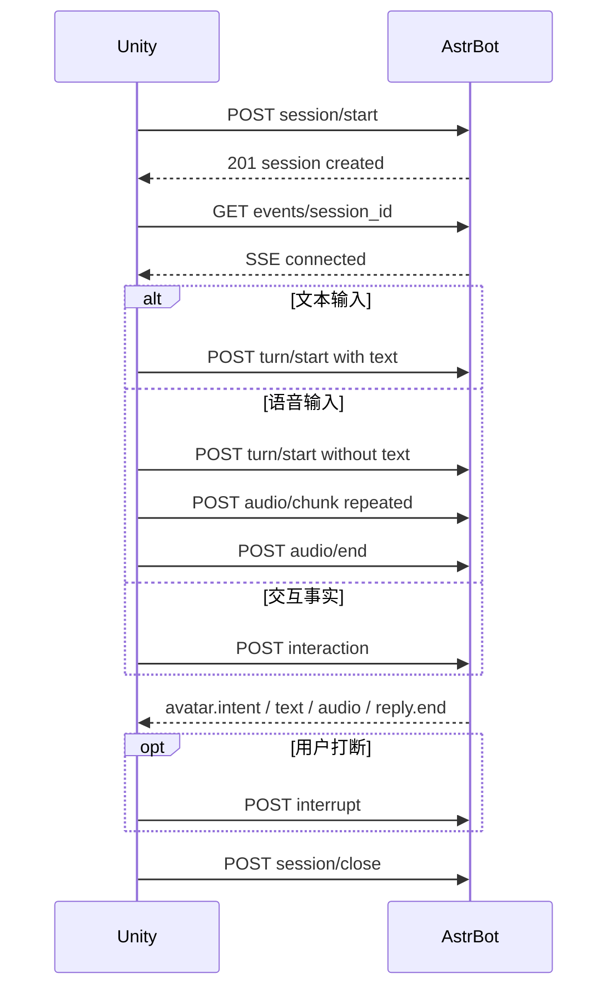

# Quest Avatar Bridge 前端接口文档

本文档面向 Meta Quest 3 上的 Unity MMD/VRM 前端。插件作者为 `qsbb`，中文名凌溪。

本机 AstrBot/Unity 部署步骤、安全配置和 curl 联调命令见 [LOCAL_INTEGRATION_CN.md](LOCAL_INTEGRATION_CN.md)。可执行协议样本位于 [`fixtures/protocol_v1/`](../fixtures/protocol_v1/)。

## 1. 协议概览

- 协议版本：`1.0`
- Unity 到 AstrBot：HTTP POST
- AstrBot 到 Unity：SSE
- 输入音频：PCM16、小端、单声道、16000 Hz
- 输出音频：PCM16、小端、单声道、24000 Hz，SSE 中使用 Base64
- 字符编码：UTF-8
- 时间单位：毫秒

Unity 只上报事实、播放音频并执行模型无关的语义意图。角色是否回应、是否接受触碰、情绪、动作、注视、强度和持续时间都由 AstrBot 决定。

### 1.1 语音适配器可用性

语音适配器默认关闭。管理员需要先在 AstrBot 的 Provider 设置中启用并选定默认 STT/TTS Provider，再打开本插件的 `enable_astrbot_stt` 或 `enable_astrbot_tts`。本插件使用 AstrBot 4.26.8 的 `Context.get_using_stt_provider()` / `Context.get_using_tts_provider()`，不通过 `hasattr()` 猜测接口，也不调用 voice_hub 未声明的内部方法。

STT 是文件式整轮调用：`audio/end` 后才把输入封装成 16000 Hz 单声道 PCM16 WAV 交给 `STTProvider.get_text(audio_url)`，因此当前不会产生 `asr.partial`。TTS 是文件式整轮调用：`TTSProvider.get_audio(text)` 完成后，本插件严格读取并规范化 Provider 返回的 WAV，才开始发送 24000 Hz 单声道 PCM16 SSE 块。

AstrBot 的 TTS Provider 基类只承诺“返回音频文件路径”，不承诺采样率、声道或编码。本插件接受未压缩 PCM16 WAV（单声道或立体声、8000-192000 Hz），立体声会下混，采样率会转换到 24000 Hz；MP3、压缩/浮点 WAV、截断或超限文件产生 `tts_failed`，文字仍会保留。`emotion` 只参与角色意图决策，不会被猜测性地传给没有该参数的 Provider。

## 2. 服务地址与认证

假设 AstrBot Dashboard 地址为：

```text
http://192.168.1.10:6185
```

接口基地址为：

```text
http://192.168.1.10:6185/api/v1/plugins/extensions/astrbot_plugin_quest_avatar_bridge
```

所有请求，包括 SSE 和 health，都必须携带：

```http
Authorization: Bearer <ASTRBOT_API_KEY_WITH_PLUGIN_SCOPE>
X-Quest-Avatar-Key: <bridge_api_key>
```

所有 POST 请求还必须携带：

```http
Content-Type: application/json
```

要求：

- AstrBot API Key 必须具有 `plugin` scope。
- `bridge_api_key` 必须与插件配置一致，且配置值至少 32 字符。
- 创建会话和后续访问必须使用同一个 AstrBot API Key 身份。
- 正式网络应通过 HTTPS 反向代理访问，不应把 Dashboard 直接暴露到公网。

## 3. 推荐调用顺序



前端应先创建会话，再立即建立 SSE。一个会话同时只允许一个 SSE 消费者。

## 4. 通用数据规则

### 4.1 标识符

`session_id`、`turn_id`、`event_id` 和 `client_id`：

- 长度 1-64。
- 首字符必须是字母或数字。
- 后续只允许字母、数字、点、下划线、冒号和连字符。
- 建议使用 UUID、递增 ID 或设备 ID，不要放入用户正文。

### 4.2 协议版本

所有请求必须包含：

```json
"protocol_version": "1.0"
```

未知版本会以 `422 schema_validation_failed` 拒绝。

### 4.3 成功响应

```json
{
  "status": "ok",
  "data": {}
}
```

### 4.4 HTTP 错误响应

```json
{
  "status": "error",
  "message": "Request schema validation failed",
  "data": {
    "code": "schema_validation_failed"
  }
}
```

## 5. 接口总表

| 方法 | 路径 | 成功状态 | 用途 |
|---|---|---:|---|
| POST | `/session/start` | 201 | 创建会话 |
| GET | `/events/<session_id>` | 200 | 建立 SSE 下行流 |
| POST | `/turn/start` | 202 | 开始文本或语音轮次 |
| POST | `/audio/chunk` | 202 | 上传一块输入 PCM16 |
| POST | `/audio/end` | 202 | 结束输入音频 |
| POST | `/interaction` | 202 | 上报交互事实 |
| POST | `/interrupt` | 200 | 打断当前轮次 |
| POST | `/session/close` | 200 | 关闭会话 |
| GET | `/health` | 200 | 查询协议和适配器状态 |

下面路径均相对于接口基地址。

## 6. 创建会话

```http
POST /session/start
```

请求：

```json
{
  "type": "session.start",
  "protocol_version": "1.0",
  "session_id": "s1",
  "client_id": "quest3-living-room",
  "user_id": "123456",
  "bot_id": "bot-main",
  "group_id": "",
  "relationship_profile_id": ""
}
```

字段：

| 字段 | 必填 | 说明 |
|---|---|---|
| `session_id` | 是 | Unity 生成的会话唯一 ID |
| `client_id` | 是 | Quest 设备或应用实例 ID |
| `user_id` | 是 | 用于可选关系快照的用户作用域，最长 128 字符 |
| `bot_id` | 是 | AstrBot Bot 作用域，最长 128 字符 |
| `group_id` | 否 | 群作用域；私聊传空字符串 |
| `relationship_profile_id` | 否 | 可选关系档案 ID |

响应：

```json
{
  "status": "ok",
  "data": {
    "protocol_version": "1.0",
    "session_id": "s1",
    "events_url": "/api/v1/plugins/extensions/astrbot_plugin_quest_avatar_bridge/events/s1"
  }
}
```

重复 `session_id` 返回 `409 session_conflict`。

## 7. SSE 事件流

```http
GET /events/s1
Accept: text/event-stream
```

连接成功首先收到注释：

```text
: connected

```

空闲时周期性收到：

```text
: keep-alive

```

业务事件格式：

```text
event: avatar.intent
data: {"type":"avatar.intent","protocol_version":"1.0","session_id":"s1","turn_id":"t3","in_reply_to_event_id":"e9","emotion":"shy","gesture":"step_back","look_at":"away","intensity":0.65,"duration_ms":1800,"reason_code":"boundary_soft_refusal"}

```

注意：

- Unity 需要按空行分隔 SSE frame，并分别解析 `event:` 和 `data:`。
- `data:` 始终是单行 UTF-8 JSON。
- SSE 没有 `Last-Event-ID` 重放协议。断线后可用同一会话重新连接，但已经消费的事件不会重放。
- `avatar.intent`、`asr.final`、`reply.end` 和 `error` 是关键事件，慢客户端下不会主动丢弃。
- `asr.partial` 可被同一轮较新的 partial 合并；文字和音频增量在极端拥塞时可以丢弃。

## 8. 开始轮次

### 8.1 文本轮次

```http
POST /turn/start
```

```json
{
  "type": "turn.start",
  "protocol_version": "1.0",
  "session_id": "s1",
  "turn_id": "t3",
  "text": "今天过得怎么样？",
  "cancel_previous": true
}
```

响应中的 `state` 为 `processing`。

### 8.2 语音轮次

省略 `text`：

```json
{
  "type": "turn.start",
  "protocol_version": "1.0",
  "session_id": "s1",
  "turn_id": "t4",
  "cancel_previous": true
}
```

响应中的 `state` 为 `awaiting_audio`。随后按顺序调用 `audio/chunk` 和 `audio/end`。

`cancel_previous=true` 会取消旧轮次并清除其待发送事件。设为 `false` 且已有活动轮次时返回 `409 session_conflict`。

## 9. 上传输入音频

```http
POST /audio/chunk
```

```json
{
  "type": "audio.chunk",
  "protocol_version": "1.0",
  "session_id": "s1",
  "turn_id": "t4",
  "sequence": 0,
  "format": "pcm16",
  "sample_rate": 16000,
  "channels": 1,
  "data": "<BASE64_PCM16>"
}
```

约束：

- PCM16 小端、单声道、16000 Hz。
- `sequence` 从 0 开始严格递增且不能跳号。
- 原始 PCM 字节数必须为偶数。
- 建议每块 40-100 ms，即 1280-3200 原始字节。
- 默认单块解码上限 16000 字节；总音频默认上限 60 秒。服务端配置可收紧或放宽。
- `audio/chunk` 成功只代表已进入当前轮的有界缓冲区；不能重发同一序号，也不能跳号。`audio/end` 没有任何有效块时返回 `400 invalid_audio`。
- `audio/end` 返回 `202` 后，STT 失败不会改写 HTTP 响应，而是在 SSE 中发送 `stt_unavailable`、`stt_failed` 或 `stt_empty`。

响应：

```json
{
  "status": "ok",
  "data": {
    "session_id": "s1",
    "turn_id": "t4",
    "sequence": 0,
    "buffered_bytes": 3200
  }
}
```

## 10. 结束输入音频

```http
POST /audio/end
```

```json
{
  "type": "audio.end",
  "protocol_version": "1.0",
  "session_id": "s1",
  "turn_id": "t4"
}
```

当 `health.data.input_audio.stt_available=false` 时，音频会完成格式和顺序校验，但随后 SSE 返回：

```text
event: error
data: {"type":"error","protocol_version":"1.0","session_id":"s1","turn_id":"t4","code":"stt_unavailable","message":"PCM16 STT is not configured"}

```

前端在 health 返回 `stt_available=false` 时，应优先使用文本轮次或在 Unity 端完成 STT 后提交文本。启用 STT 后，仍需等待 `asr.final`；本版不提供 partial 识别。

## 11. 上报交互事实

```http
POST /interaction
```

```json
{
  "type": "interaction",
  "protocol_version": "1.0",
  "session_id": "s1",
  "event_id": "e9",
  "name": "head_pat",
  "phase": "start",
  "strength": 0.7,
  "duration_ms": 0,
  "hand": "right"
}
```

允许值：

```text
name:  handshake | head_pat | cheek_pinch | gaze | speaking
phase: start | update | end | cancel
hand:  left | right | both | none
```

`strength` 范围为 0-1，`duration_ms` 范围为 0-600000。

响应：

```json
{
  "status": "ok",
  "data": {
    "session_id": "s1",
    "event_id": "e9",
    "accepted": true,
    "turn_id": "i:e9",
    "reason": "accepted"
  }
}
```

重复 `event_id` 或去抖窗口内的同名同阶段事件返回 `accepted=false` 和 `reason=duplicate_or_debounced`，不是 HTTP 错误。

交互建立 `i:<event_id>` 决策轮次并取消旧活动轮次。Unity 不得把触碰名称自行固定映射为情绪。

## 12. 打断

```http
POST /interrupt
```

```json
{
  "type": "interrupt",
  "protocol_version": "1.0",
  "session_id": "s1",
  "turn_id": "t3",
  "reason": "user_started_speaking"
}
```

`turn_id` 可省略，此时打断当前轮。响应：

```json
{
  "status": "ok",
  "data": {
    "session_id": "s1",
    "turn_id": "t3",
    "cancelled": true
  }
}
```

收到打断后，旧轮次不会继续发送文字、音频、动作或 `reply.end`。如果目标轮次已经不是当前轮，返回 `cancelled=false`。

## 13. 关闭会话

```http
POST /session/close
```

```json
{
  "type": "session.close",
  "protocol_version": "1.0",
  "session_id": "s1"
}
```

响应：

```json
{
  "status": "ok",
  "data": {
    "session_id": "s1",
    "closed": true
  }
}
```

关闭会取消任务、清空音频和队列，并结束 SSE。前端退出场景或切换角色会话时必须调用。

## 14. 健康检查

```http
GET /health
```

响应示例：

```json
{
  "status": "ok",
  "data": {
    "protocol_version": "1.0",
    "transport": "http+sse",
    "input_audio": {
      "format": "pcm16",
      "sample_rate": 16000,
      "channels": 1,
      "stt_available": false
    },
    "output_audio": {
      "format": "pcm16",
      "sample_rate": 24000,
      "channels": 1,
      "tts_available": false
    },
    "active_sessions": 1,
    "attached_streams": 1,
    "queued_events": 0
  }
}
```

## 15. 下行 SSE 事件

### 15.1 `asr.partial`

```json
{
  "type": "asr.partial",
  "protocol_version": "1.0",
  "session_id": "s1",
  "turn_id": "t4",
  "text": "识别中的文本"
}
```

可合并；首版默认不会产生。

### 15.2 `asr.final`

```json
{
  "type": "asr.final",
  "protocol_version": "1.0",
  "session_id": "s1",
  "turn_id": "t4",
  "text": "最终识别文本"
}
```

### 15.3 `reply.text.delta`

```json
{
  "type": "reply.text.delta",
  "protocol_version": "1.0",
  "session_id": "s1",
  "turn_id": "t3",
  "text": "回复增量"
}
```

同一 `turn_id` 按到达顺序拼接。

### 15.4 `reply.audio.chunk`

```json
{
  "type": "reply.audio.chunk",
  "protocol_version": "1.0",
  "session_id": "s1",
  "turn_id": "t3",
  "format": "pcm16",
  "sample_rate": 24000,
  "channels": 1,
  "data": "<BASE64_PCM16>"
}
```

默认目标块长 50 ms，配置范围 40-100 ms。`reply.audio.chunk` 是受背压保护的有序事件，慢客户端不会主动丢音频块；生产者会等待队列消费，或在 interrupt/close 时被取消。Unity 应按真实 PCM 播放进度驱动嘴型，不应按文字估算。

### 15.5 `avatar.intent`

```json
{
  "type": "avatar.intent",
  "protocol_version": "1.0",
  "session_id": "s1",
  "turn_id": "i:e9",
  "in_reply_to_event_id": "e9",
  "emotion": "uncomfortable",
  "gesture": "refuse",
  "look_at": "away",
  "intensity": 0.65,
  "duration_ms": 1800,
  "reason_code": "boundary_soft_refusal"
}
```

白名单：

```text
emotion: neutral | happy | shy | surprised | concerned | uncomfortable
gesture: idle | talk | wave | bow | handshake | head_pat | cheek_pinch | refuse | step_back
look_at: user | hand | away | none
```

`in_reply_to_event_id` 在非交互轮次可能为 `null`。`reason_code` 用于诊断和行为选择，不应作为骨骼、Morph 或动画路径。

Unity 必须再次按当前模型能力检查 `gesture`。不支持时安全降级到 `idle`；未知 `emotion` 降级到 `neutral`，未知 `look_at` 降级到 `none`。

### 15.6 `reply.end`

```json
{
  "type": "reply.end",
  "protocol_version": "1.0",
  "session_id": "s1",
  "turn_id": "t3",
  "status": "completed",
  "text_sent": true,
  "audio_sent": false
}
```

前端收到后才能把该轮标记为正常完成。被打断的旧轮不会收到 `reply.end`。

### 15.7 `error`

```json
{
  "type": "error",
  "protocol_version": "1.0",
  "session_id": "s1",
  "turn_id": "t3",
  "code": "turn_failed",
  "message": "Turn generation failed"
}
```

SSE `error` 是轮次级错误；HTTP 错误是请求级错误，两者必须分别处理。

稳定的 SSE 错误码：

| `code` | 含义 | 前端处理 |
|---|---|---|
| `stt_empty` | 没有识别到有效文本 | 提示重说，不自动重放旧音频 |
| `stt_unavailable` | 后端未配置 PCM16 STT | 切换到文本输入或 Unity 侧 STT |
| `stt_failed` | STT 执行失败 | 结束当前轮，允许用户重试 |
| `turn_failed` | 普通文本轮生成失败 | 结束当前轮，不执行猜测动作 |
| `interaction_failed` | 交互决策失败 | 保持安全 idle，不自行映射情绪 |
| `tts_failed` | 文本可用但语音合成失败 | 保留文字，停止等待音频 |

收到 interrupt 成功响应后，旧轮的 `asr.partial`、`asr.final`、`reply.text.delta`、`reply.audio.chunk`、`avatar.intent`、`error` 和 `reply.end` 均禁止继续生效。响应到达前已由网络发送的数据可能仍在客户端缓冲区，Unity 仍必须按当前 `(session_id, turn_id)` 丢弃旧轮数据。

## 16. HTTP 错误码

| HTTP | `data.code` | 处理建议 |
|---:|---|---|
| 400 | `invalid_content_length` | 修正 Content-Length |
| 400 | `empty_body` | 提交 JSON 请求体 |
| 400 | `invalid_audio` | 检查 Base64、PCM16 偶数字节和 sequence |
| 401 | `astrbot_auth_required` | 检查 AstrBot API Key |
| 401 | `bridge_auth_failed` | 检查 `X-Quest-Avatar-Key` |
| 403 | `session_ownership_mismatch` | 使用创建会话时的 API Key |
| 404 | `session_not_found` | 重新创建会话 |
| 409 | `session_conflict` | 检查重复会话、活动轮次或重复 SSE |
| 413 | `payload_too_large` | 减小请求或音频块 |
| 415 | `unsupported_media_type` | 使用 `application/json` |
| 422 | `schema_validation_failed` | 按本文档修正字段、枚举和范围 |
| 500 | `internal_error` | 记录请求 ID/状态并查看 AstrBot 日志，不要无限重试 |
| 503 | `bridge_not_configured` | 配置至少 32 字符的 bridge key |

## 17. Unity 实现检查表

- 使用一个长期 HTTP GET 读取 SSE；Unity 侧需要自行解析 SSE frame 并设置两个认证头。
- 以 `(session_id, turn_id)` 作为文字、音频和动作的路由键。
- 发起新轮或交互前停止本地旧轮播放；同时调用 `interrupt` 或使用 `cancel_previous=true`。
- 收到旧 `turn_id` 的迟到网络数据时直接丢弃。
- PCM16 Base64 解码后按 24000 Hz、单声道、16 位播放。
- 嘴型只跟随实际播放缓冲区，不跟随 `reply.text.delta`。
- 先执行模型能力检查，再映射语义动作；映射表由 Unity 模型适配层持有。
- 不根据 `head_pat`、`cheek_pinch` 等输入事件预判情绪。
- 网络断开时停止本地旧音频和动作，重连 SSE；会话不存在时重新执行 `session/start`。
- 应用退出、切换用户或切换角色时调用 `session/close`。

## 18. 首版能力限制

- 默认 STT/TTS adapter 关闭；文本轮次和角色意图链可用。启用后仍是文件式整轮 Provider，不是流式 STT/TTS。
- AstrBot 4.26.8 的公开 TTS Provider 没有结构化 emotion 或固定输出 PCM 契约；本插件通过 WAV 解析和重采样建立输出约束，无法解析的 Provider 音频会 `tts_failed`。
- `astrbot_plugin_voice_hub` 的 `voice.delivery@1.0` 只声明 `plan_delivery` 和 `consume_delivery_plan`，没有原始 PCM STT/TTS 能力；本插件不会猜测或调用其内部 `synthesize_text()`。
- 没有公开 WebSocket 接口，前端不得尝试连接猜测的 WebSocket 路径。
- 未完成 Quest 真机网络、麦克风回声、嘴型和具体模型动作验收。
- 协议只返回语义意图，不会返回 PMX 骨骼、Morph、Unity 对象或本地动画路径。
